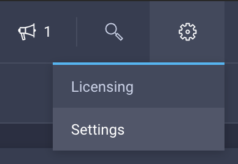
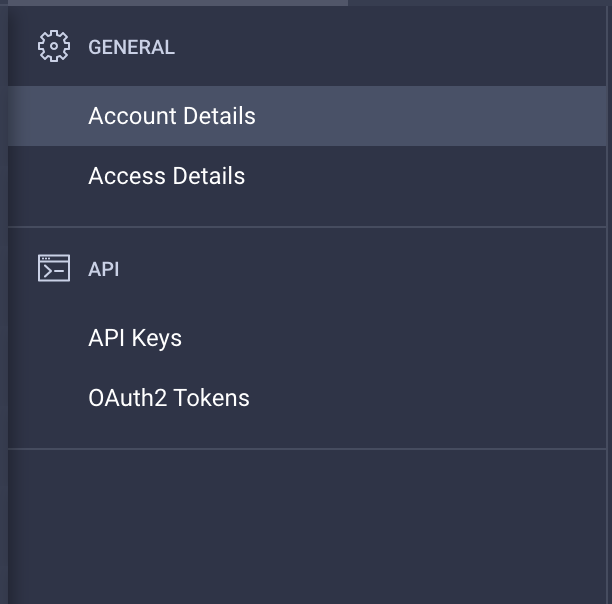
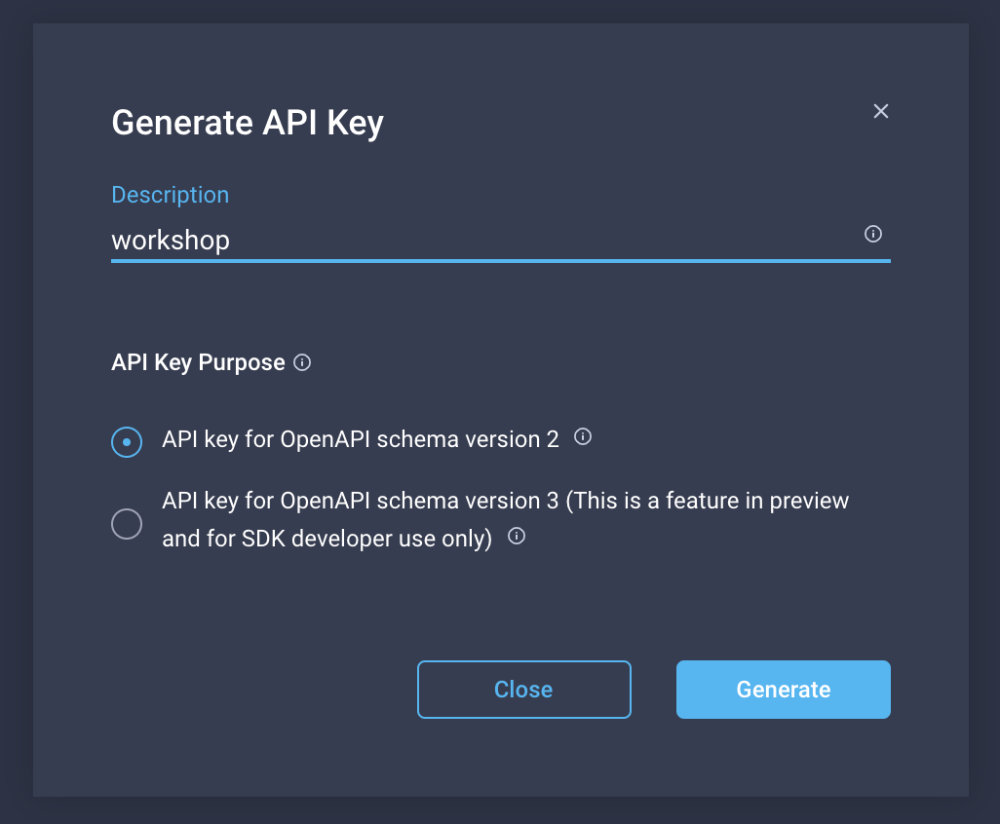

## Lösung 1

Um den API Key zu erstellen, auf intersight.com einloggen, und dann folgende Aktionen durchführen:

Auf das Zahnrad oben rechts klicken, dann weiter auf Settings.

In den Settings auf der linken Seite API Keys auswählen.

Oben rechts auf Generate API Key klicken.

Eine description eingeben, dann auf Generate klicken um den key zu erstellen.

Bitte die API Key ID in den Texteditor kopieren, und den Secret Key downloaden. Der Secret Key ist nach dem schließen des Fensters nicht mehr sichtbar!