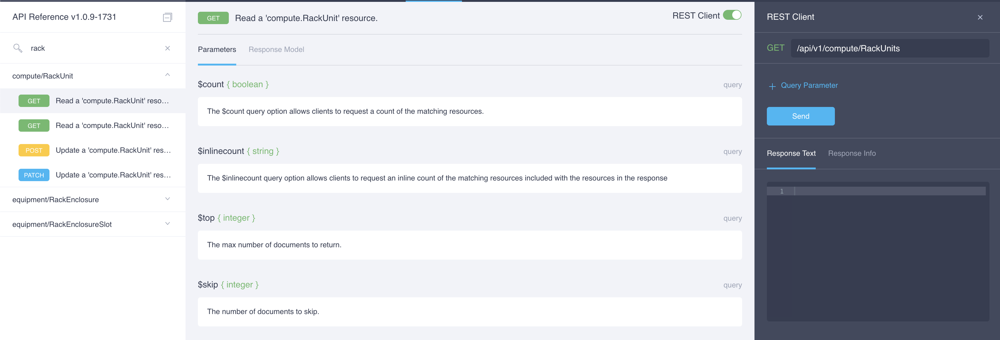
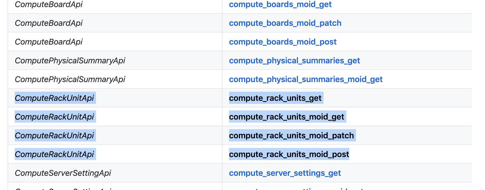

## Lösung 3

Um die Rackserver zu bekommen können wir zuerst die API Dokumentation anschauen: https://intersight.com/apidocs



Unter compute/RackUnit finden wir die Abfragen um Rackserver zu finden. Wir können das auch direkt im Browser ausführen und uns so ein Beispiel ansehen. Wenn wir das dann in Python verwenden wollen können wir die API Dokumentation des Intersight Python Moduls ansehen: https://github.com/CiscoUcs/intersight-python

Wir können dann innerhalb der Dokumentaiton nach den Methoden für compute/RackUnit suchen, und werden dabei folgende Methoden finden:



Rechts davon befinden sich weitere Details zur jeweiligen Abfrage. Wir benötigen in diesem Fall die Methode 'compute_rack_units_get' von 'ComputeRackUnitApi'. In Python sieht das folgendermaßen aus:

```python
rackApi = intersight.ComputeRackUnitApi(api_instance)
rack_servers = rackApi.compute_rack_units_get()
```

Diese Abfrage liest alle Rackserver aus. Wir können dann über das Objekt einen for Loop machen um alle Ergebnisse auszugeben:

```python
for server in rack_servers.results:
    print('Serial: {}, MOID: {}, Model: {}'.format(server.serial,server.model,server.moid))
```
