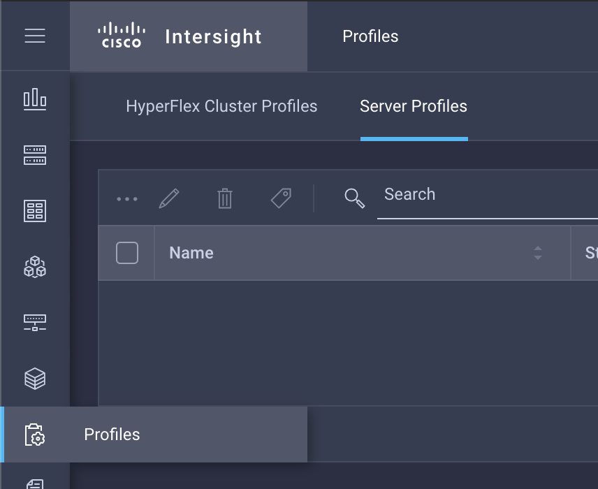
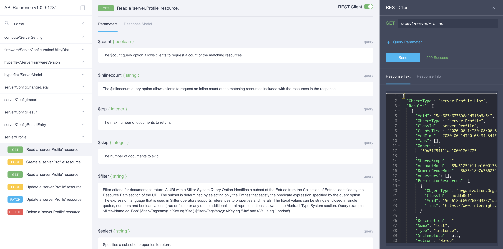

## Lösung 6

Wir wollen jetzt einen Server konfigurieren. Dafür erstellen wir ein Profil das die Servereinstellungen beinhaltet. Profile sind etwas komplexer als die bisherigen Abfragen. Um ein Objekt zu erstellen benötigen wir ein JSON Objekt. Diese Definition könnten wir händisch schreiben, aber es ist einfacher wenn wir einfach ein Profil erstellen, und dann diese Definition abändern, und für unsere Automatisierung verwenden.

Wir gehen dazu auf intersight.com und klicken dann auf Profiles > Server Profiles. Dann klicken wir oben rechts auf den Button 'Create Server Profile'. Wir müssen dem Profil einen Namen geben, ansonsten müssen wir nur einmal auf 'Next' und dann auf 'Save & Close' klicken. Damit ist ein leeres Profil erstellt.



Wir können jetzt auf die Intersight API Docs gehen (https://intersight.com/apidocs) und dort eine Abfrage durchführen um uns das Profil anzusehen:



Dieses Profil beinhaltet einige Daten die erst nach der Erstellung verfügbar sind. Diese müssen wir entfernen damit alles funktioniert. Wir können aber einfach mal alles in Python kopieren uns es dann Schritt für Schritt basierend auf den Fehlern die wir bekommen anpassen. Wir haben hier schon mal ein funktionierendes Profil:

```python
profile =     {
      "Description": "",
      "Name": "workshop-profile",
      "Type": "instance",
      "Action": "No-op",
      "ConfigContext": {
        "ClassId": "policy.ConfigContext",
        "ObjectType": "policy.ConfigContext",
        "ConfigState": "Not-assigned",
        "ControlAction": "No-op",
        "ErrorState": "",
        "OperState": ""
      },
      "ConfigChanges": {
        "ClassId": "policy.ConfigChange",
        "ObjectType": "policy.ConfigChange",
        "Changes": [],
        "Disruptions": []
      },
      "IsPmcDeployedSecurePassphraseSet": False,
      "Organization": {
        "ObjectType": "organization.Organization",
        "ClassId": "mo.MoRef",
        "Moid": "5ee612af6972652d33271daf",
        "link": "https://www.intersight.com/api/v1/organization/Organizations/5ee612af6972652d33271daf"
      }
    }
```

Das Profil zu erstellen ist dann eigentlich relativ einfach. Wir müssen nur die API instanziieren und eine Abfrage mit der korrekten Methode schicken. Innerhalb der Methode geben wir das oben definierte Profil an:

```python
profileApi = intersight.ServerProfileApi(api_instance)

profileApi.server_profiles_post(body=profile)
```

Um die MOID des neuen Profils zu finden können wir alle Server Profile abfragen und das korrekte aufgrund des Namens finden:

```python
server_profiles = profileApi.server_profiles_get()

for profile in server_profiles.results:
    if profile.name == 'workshop-profile':
        profile_moid = profile.moid
```

Diese MOID werden wir in der nächsten Übung benötigen.