## Lösung 8

In intersight.com auf die Seite Orchestration wechseln.

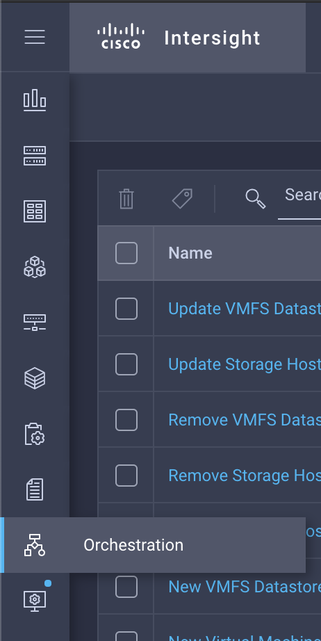

Oben rechts auf Create New Workflow klicken.

Den Task New Virtual Machine from Template in den Workflow Designer ziehen.

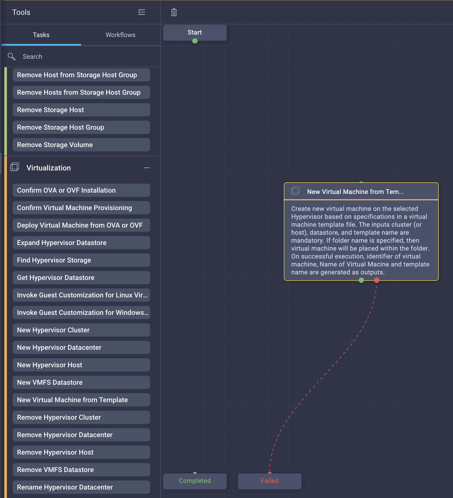

Den task mit Start und Completed verbinden.

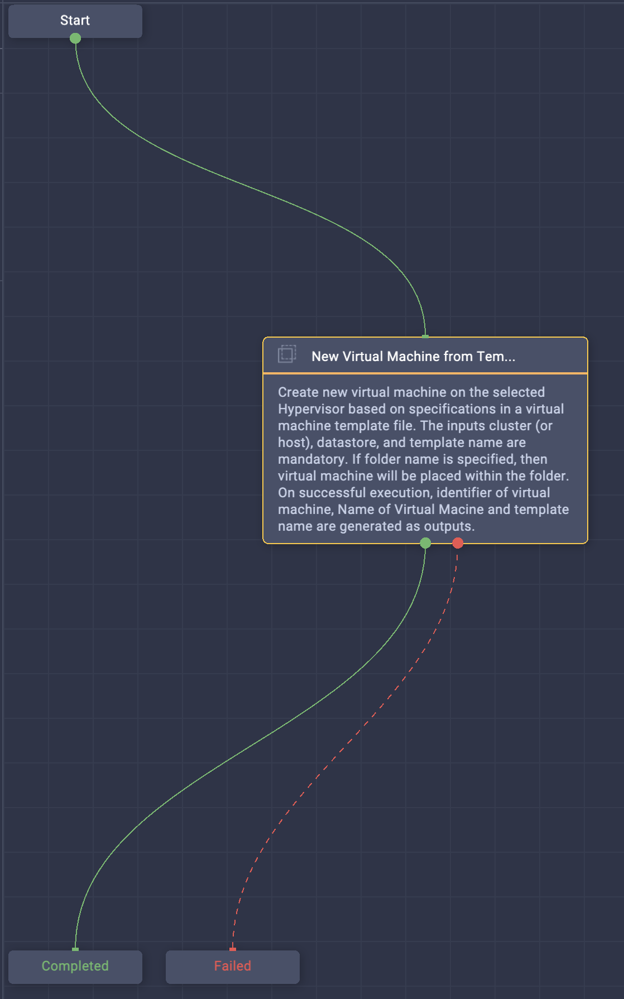

Workflow Einstellungen anpassen.

Auf den Task klicken um die Task Einstellungen zu ändern. Dafür muss möglicherweise der workflow gespeichert, und neu geöffnet werden. Dann auf Inputs gehen, hier müssen wir anpassen.

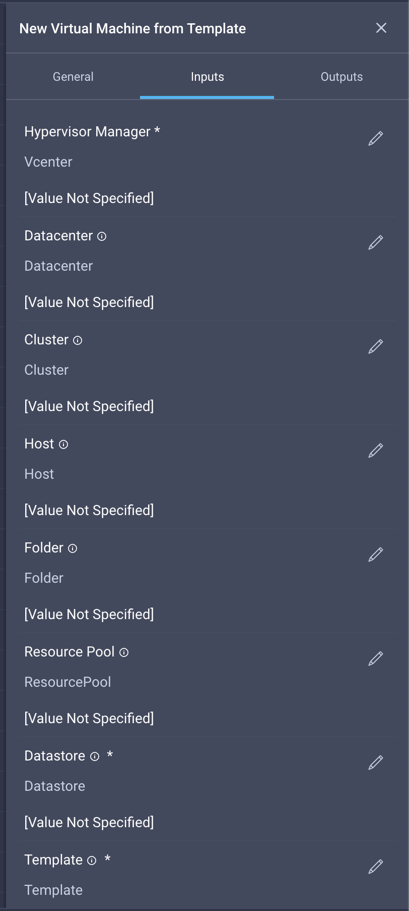

Auf den 'Hypervisor Manager' Input klicken, hier erscheint dann diese Auswahl:

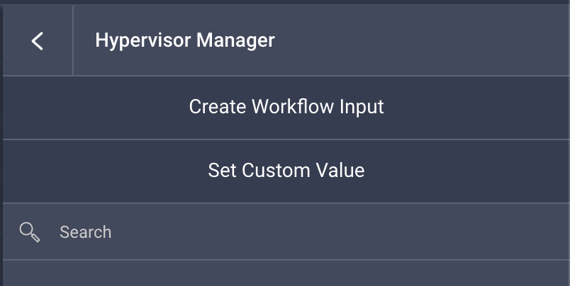

Zuerst auf 'Set Custom Value' klicken, und dann in dem Fenster das erscheint das vCenter auswählen. Diesen gleichen Schritt machen wir auch für das Datacenter, den Cluster, und den Datastore.

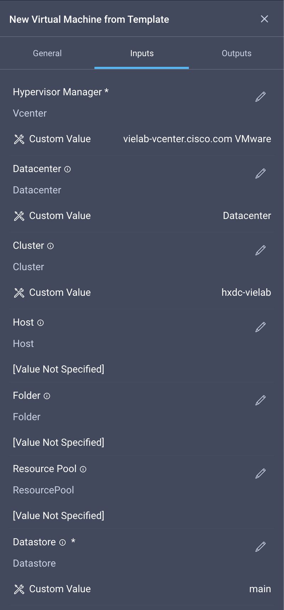

Für das VM Template müssen wir ebenfalls 'Set Custom Value' machen, allerdings muss dieses mal der String manuell kopiert werden.

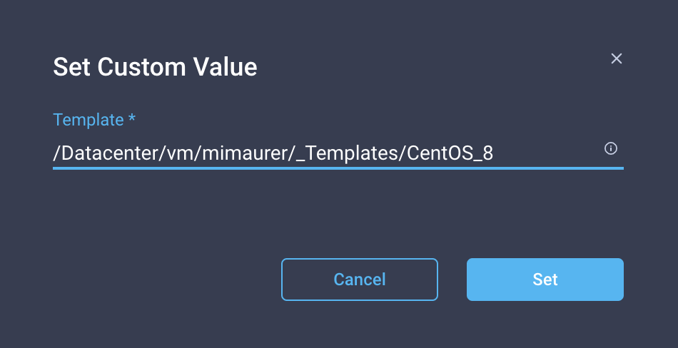

Für Virtual Machine auf 'Create Workflow Input' klicken:

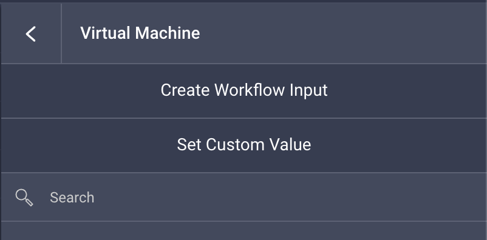

Dann bitte den Input so definieren:

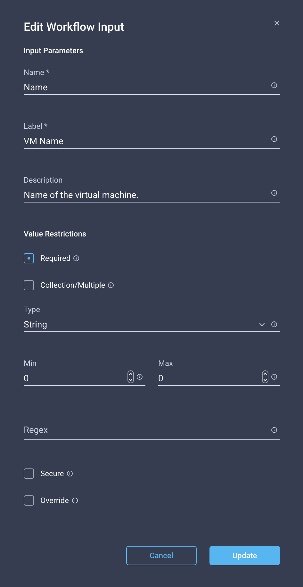

Der Workflow Input wird dann beim Start des workflows abgefragt.

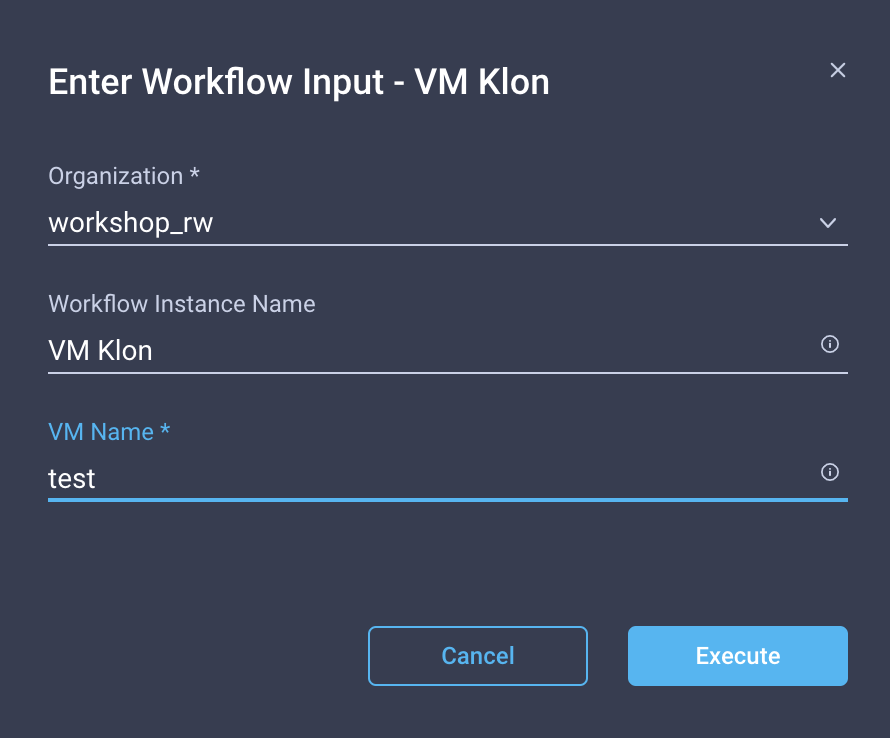

Oben rechts auf Execute klicken. Der ausgeführte Workflow sieht dann so aus:

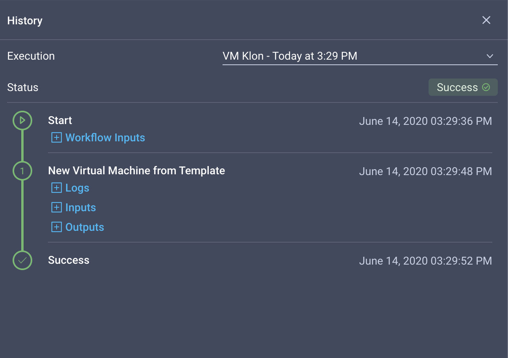
